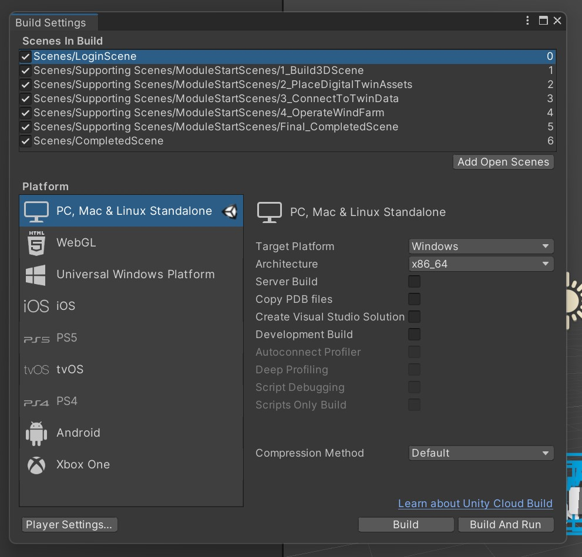

# **“微软工业元宇宙”动手实验指导（v1.0）**

## **实验目标**

本实验旨在让使用者了解 “微软元宇宙技术栈“中的主要技术和工具，以及Web3.0的概念，并结合一个能源行业的场景，给使用者初步的元宇宙应用体验。


## **实验贡献者**
本动手实验基于 [Build mixed reality digital twins with Azure Digital Twins and Unity - Training | Microsoft Learn](https://learn.microsoft.com/en-us/training/paths/build-mixed-reality-azure-digital-twins-unity/) 在线课程，并由微软中国的多位专家 Alex Zhao, Yingguang Mei, Wayne Wang 和 Warren Zhou 修改和完善而来。

---

## **实验三：在元宇宙场景使用数字钱包登录公链和读写数据**

在本实验里，你将会运用web3.0智能合约创建一个数字钱包，并创建一个NFT的收藏夹，及相关的智能合约，并将其部署到Azure Function发布成无服务。然后您可以将在实验一建成的数字孪生模型，MINT成NFT，然后发布到您的NFT收藏夹，让其变为有价值的数字资产。后续您还可以将生成的这些NFT，发布到NFT市场，用来和别的数字钱包拥有者进行交易。本实验用到的区块链网络均为测试网络，交易使用的Gas Fee均为测试币。

### **实验环境与准备**

- [Install VSCode](https://code.visualstudio.com/)

- [Install Postman](https://www.postman.com/)

  如果你是mac系统或者Linux系统，请跳过下面的步骤

- [Install WSL 2.0 with Ubuntu 20.04](https://learn.microsoft.com/en-us/windows/wsl/install) 

- [Install WSL remote debug in VSCode](https://code.visualstudio.com/docs/remote/wsl)

### **实验流程**

1. 注册数字钱包

   - 默认钱包用**MetaMask**，如果您有其他钱包也可以使用。

   - 官网下载钱包浏览器插件，访问[MetaMask官网](https://metamask.io/)，选择右上角Download，选择Edge版本，下载到您个人PC上。

     

   - 下载后，在Edge浏览器上方打开MetaMask插件（小狐狸图标），点击创建钱包，密码，复制**[钱包地址]**到本地记事本。

     (例如下方划红线的hash code，点击并复制)

     

   - 点击右上方...，选择**Account Details**，选择**Export Private Key**，保存**[钱包私钥]**到本地记事本。

     

   - 点击钱包上方网络部分，选择**Add Network**

     

   - 在打开的网页里，选择左侧栏Advanced，下拉选中显示测试网络。

   - 再回到MetaMask插件，点击上方网络部分，就可以看到**Goerli test network**了，选择此测试网络。

     

   - 访问 [GoerliFaucet]([Goerli Faucet](https://goerlifaucet.com/))，输入你的钱包地址Hash Code，选择Send Me ETH，每24小时，可以给你的钱包的Goerli test network里发0.2GoerliETH的测试币，可能需要VPN才能发送成功。1分钟之内就能在钱包里收到此测试币，用来支付后续实验的Gas Fee。

     

2. 创建NFT收藏夹

   - 访问 [ThirdWeb](https://thirdweb.com/)，点击**Start Building**。

     


   - 点击右上角**Connect Wallet**，选择**MetaMask**弹出**Edge**插件后，点击**Confirm**，用钱包登录**ThirdWeb**。

     


   - 点击右上角**Deploy new contract**，转到Contract页面后，在**I want to get started with a prebuilt contract**下方点击**Get Started**。

     


   - 找到**NFT Collection**，点击右侧小箭头部署合约。

     


   - 转到 [Dashboard](https://thirdweb.com/dashboard) 页面，进入刚才创建好的NFT Collection ，点击**Code**，记录*[NFT收藏夹合约地址]*。

     


3. 部署本地合约到Azure Function

   - 打开本地**Ubuntu 20.04 Console**，输入**/mnt/[drive]/[project path]** 回车，然后输入 **code .** 

     


   - 本地创建Azure Function并调试合约，参考 [Create a function in Azure with Python using Visual Studio Code](https://learn.microsoft.com/en-us/azure/azure-functions/create-first-function-vs-code-python?pivots=python-mode-configuration) 


- 创建3个本地Function

  - 在本地function根目录下的**requirement.txt**里添加**thirdweb-sdk**

    

  - 创建Wallet Login Thirdweb Function，输入自定义*[web3funclogin]*，并输入以下代码。

    ```python
    import logging
    from thirdweb import ThirdwebSDK
    from thirdweb.types.nft import NFTMetadataInput
    
    import azure.functions as func
    
    def main(req: func.HttpRequest) -> func.HttpResponse:
        logging.info('Python HTTP trigger function processed a request.')
        req_body = req.get_json()
        name = req_body["username"]
        #name = req.params.get('username')
        if name == "[自定义用户名]":
            try:
                # 输入记事本里保存的 [钱包私钥]
                PRIVATE_KEY = "[钱包私钥]"
                # You can customize this to a supported network or your own RPC URL
                network = "goerli"
    
                # Now we can create a new instance of the SDK
                sdk = ThirdwebSDK.from_private_key(PRIVATE_KEY, network)    
                return func.HttpResponse(f"Hello, {name} login successfully.")
    
            except ValueError:
                return func.HttpResponse("User {name} private key is wrong", status_code=200)
    
            else:
                return func.HttpResponse(
                    "user is empty",
                    status_code=200
                )
    ```

  - 创建List NFT Function，输入自定义*[web3funclistnfts]*，并输入以下代码。

    ```python
    import logging
    from thirdweb import ThirdwebSDK
    from thirdweb.types.nft import NFTMetadataInput
    import json
    import azure.functions as func
    
    def default_json(t):
        return f'{t}'
    
    def listToJson(self):
        d = []
        for o in self:
            d.append({"NFTMetadataOwner": 
            {'metadata': {
                    'id': o.metadata.id,
                    'uri':o.metadata.uri,
                    'nft_name':o.metadata.name,
                    'nft_description':o.metadata.description,
                    'image_url':o.metadata.image
                }, 
            'owner': o.owner}})
        return json.dumps({"response" : d})
    
    def main(req: func.HttpRequest) -> func.HttpResponse:
        logging.info('Python HTTP trigger function processed a request.')
    
        req_body = req.get_json()
        name = req_body["username"]
        #name = req.params.get('username')
        if name == "[自定义用户名]":
            try:
                # 输入记事本里保存的 [钱包私钥]
                PRIVATE_KEY = "[钱包私钥]"
    
                # You can customize this to a supported network or your own RPC URL
                network = "goerli"
    
                # Now we can create a new instance of the SDK
                sdk = ThirdwebSDK.from_private_key(PRIVATE_KEY, network)    
                contract = sdk.get_nft_collection("[NFT收藏夹合约地址]")
                nft_list = contract.get_all()
                reposnse = listToJson(nft_list)
                return func.HttpResponse(reposnse)
           
            except ValueError:
                return func.HttpResponse("[Customrized Error Message]", status_code=200)
        else:
            return func.HttpResponse(
                 "user is empty",
                 status_code=200
            )
    ```

  - 创建Mint NFT Function，输入自定义*[function name]*，并输入以下代码。

    ```python
    import logging
    from thirdweb import ThirdwebSDK
    from thirdweb.types.nft import NFTMetadataInput
    import json, os
    import azure.functions as func
    import base64
    
    def default_json(t):
        return f'{t}'
    
    def listToJson(self):
        return json.dumps({"NFTMetadataOwner": 
            {'metadata': {
                    'id': self.metadata.id,
                    'uri':self.metadata.uri,
                    'nft_name':self.metadata.name,
                    'nft_description':self.metadata.description,
                    'image_url':self.metadata.image
                }, 
            'owner': self.owner}})
    
    def main(req: func.HttpRequest) -> func.HttpResponse:
        logging.info('Python HTTP trigger function processed a request.')
    
        req_body = req.get_json()
        name = req_body["username"]
        nft_name = req_body["nftname"]
        nft_desc = req_body["nftdesc"]
        file_name = req_body["filename"]
        base64_file = req_body["base64stream"]
    
        base64_img_bytes = base64_file.encode('utf-8')
        a_file_target = os.path.join('/tmp/', file_name)
        with open(a_file_target, 'w+b') as file_to_save:
            decoded_image_data = base64.urlsafe_b64decode(base64_img_bytes)
            file_to_save.write(decoded_image_data)
    
        if name == "[自定义用户名]":
            try:
                # 输入记事本里保存的 [钱包私钥]
                PRIVATE_KEY = "[钱包私钥]"
                # You can customize this to a supported network or your own RPC URL
                network = "goerli"
    
                # Now we can create a new instance of the SDK
                sdk = ThirdwebSDK.from_private_key(PRIVATE_KEY, network)    
                contract = sdk.get_nft_collection("[NFT收藏夹合约地址]")
                # Note that you can customize this metadata however you like
                metadata = NFTMetadataInput.from_json({
                    "name": nft_name,
                    "description": nft_desc,
                    "image": open(a_file_target,"rb")
                })
    
                # You can pass in any address here to mint the NFT to
                tx = contract.mint_to("[钱包地址]", metadata)
                receipt = tx.receipt
                token_id = tx.id
                nft = tx.data()
                response = listToJson(nft)
                return func.HttpResponse(response)
           
            except ValueError:
                return func.HttpResponse("[Customrized Error Message]", status_code=200)
        else:
            return func.HttpResponse(
                 "user is empty",
                 status_code=200
            )
    ```

- 本地调试 [Run the function locally](https://learn.microsoft.com/en-us/azure/azure-functions/create-first-function-vs-code-python?pivots=python-mode-configuration#run-the-function-locally) 

  需要创建python3的虚拟环境，按文档说明进行本地Debug。(记得在py脚本里加断点)

  

  测试Wallet Login Function 和 List NFT Function

  - 打开**Postman**，点击**Import**

  

  - 选择**Raw text**输入以下脚本，替换*[自定义用户]*，点击**Import**

    ```json
    {
    	"info": {
    		"_postman_id": "f8b6346e-d2c0-4e88-a171-2743ffa9d2a6",
    		"name": "[web3func]",
    		"schema": "https://schema.getpostman.com/json/collection/v2.1.0/collection.json",
    		"_exporter_id": "18372135"
    	},
    	"item": [
    		{
    			"name": "web3login",
    			"request": {
    				"method": "POST",
    				"header": [
    					{
    						"key": "Content-Type",
    						"value": "application/json",
    						"type": "text"
    					}
    				],
    				"body": {
    					"mode": "raw",
    					"raw": "{\"username\":\"[自定义用户]\"}",
    					"options": {
    						"raw": {
    							"language": "json"
    						}
    					}
    				},
    				"url": {
    					"raw": "https://web3funcs.azurewebsites.net/api/web3funclogin",
    					"protocol": "https",
    					"host": [
    						"web3funcs",
    						"azurewebsites",
    						"net"
    					],
    					"path": [
    						"api",
    						"web3funclogin"
    					]
    				}
    			},
    			"response": []
    		},
    		{
    			"name": "web3listnft",
    			"request": {
    				"method": "POST",
    				"header": [
    					{
    						"key": "Content-Type",
    						"value": "application/json",
    						"type": "text"
    					}
    				],
    				"body": {
    					"mode": "raw",
    					"raw": "{\"username\":\"[自定义用户]\"}"
    				},
    				"url": {
    					"raw": "https://web3funcs.azurewebsites.net/api/web3funclistnfts",
    					"protocol": "https",
    					"host": [
    						"web3funcs",
    						"azurewebsites",
    						"net"
    					],
    					"path": [
    						"api",
    						"web3funclistnfts"
    					]
    				}
    			},
    			"response": []
    		}
    	]
    }
    ```

  测试Mint NFT Function

  - 在另一个目录下，创建一个新Python文件，用来测试本地Mint NFT Function。输入**code .** 打开另一个vscode

    

  - 在目录下创建文件夹**images**，放一张测试JPG图片。

  - 输入以下脚本并运行。

    ```python
    import requests, os, json
    
    url = "http://localhost:7071/api/web3funcmint"
    path = "images/[IMAGE NAME].jpg"
    
    payload = {"username": "[自定义用户名]","nftname":"[NFT NAME]","nftdesc":"[NFT DESCRIPTION]"}
    files = {
        'json': (None, json.dumps(payload), 'application/json'),
        'file': (os.path.basename(path), open(path, 'rb'), 'application/octet-stream')
    }
    #Upload File
    r = requests.post(url, files=files)
    print(r.text)
    ```

  - 在本地Function App里Debug。

    

- Deplay 本地 Function on Azure

  - [Deploy project to Azure](https://learn.microsoft.com/en-us/azure/azure-functions/create-first-function-vs-code-python?pivots=python-mode-configuration#deploy-the-project-to-azure)

  - 同样用**Postman**和VSCode 测试Azure FUnction，把**localhost:7071** 替换成Azure Function Endpoint即可，例如**web3funcs.azurewebsites.net**

    

    

- 打开thirdweb的，您自己创建的收藏夹，将会看到刚创建好的NFT。

  

- 在DevHack专用NFT市场进行挂售，所用区块链网络均为测试网络，Gas Fee均为测试币。

  市场合约地址: 0xd5d707661FD86645E94b9Ae1069e31caB97c5eFE

  市场链接 [DevHack Marketplace](https://thirdweb.com/goerli/0xd5d707661FD86645E94b9Ae1069e31caB97c5eFE/listings)

  

5. 在Unity项目中启用的NFT集成的登录流程

   - 打开之前 实验二完成的Unity 项目
   - 创建新的登录scene. 这里将其起名为`LoginScene`
   - 打开`File` ->`Build Settings` 确定 将`LoginScene` 加入列表并且作为启动项（列表中的第一个）

   

   - 打开LoginScene 将 `UIPrefesbs/Prefebs/LoginUI.prefeb` 拖拽入Scene,

     - 此时界面示意
       

       Note:Login 按钮默认为不可见

        - 确认界面中三个按钮对`LoginController.cs` 代码的事件绑定：
          - `void Login()`
          - `void SelectUser1()`
          - `void SelectUser2()`

     - 代码解析

       -  在这个Scene中，我们通过Login按钮触发 `FunctionCalls.cs`中的`CallLogin`方法，调用fucntion中定义好的接口，完成登录

     ``` csharp
     public void CallLogin(string userName, Action<string> callBack)
     {
         StartCoroutine(PostJsonData<UserNameRequestMessage, string>("https://web3funcs.azurewebsites.net/api/web3funclogin", new UserNameRequestMessage { username = userName },callBack));    
     }
     ```

       - 该函数调用的通用Post处理函数`PostJsonData`能够按照json发送数据获得需要的类型结果 并且将这个结果通过`callback` 代理重新应用到UI上。

       Login处理登陆结果的逻辑如下

       ``` csharp
     public void Login()
     {
       gameObject.GetComponent<FunctionCalls>().CallLogin(UserSelected, r =>
       {
           Error = r;
           if (Error.Contains("successfully"))
           {
               SceneManager.LoadScene("CompletedScene");
           }
           RefreshStatus();
       });
     }
       ```

   - 登陆成功后 UI跳转到之前的主场景。这里使用`CompletedScene`。您可以选择您自己完成的scene名称

   - 运行项目 这时选择不同的User后点击`Login`按钮 会根据服务端返回跳转到您设定的下一个场景


6. 在Unity项目中创建"异常报告"场景

   - 打开之前建立的风力发电Scene. 本教程在这里使用`CompletedScene`代替。

   - 将另一个Prefeb 'ReportAbnormal' 加入`Root/Bing Maps Operate` 并确认其位置为 `0,0,0`

   - 此时在地图下方将显示一个红色按钮。
     

   - 确认按钮对 `ReportAbnormalUIController.cs`中代码的事件绑定

     - `void CallSnapshotReport()`

   - 当红色按钮被按下, 应用将保存当前收到的运行数据快照 并且保存到NFT，
     并且进行交易历史刷新
     

     - 代码解析
       获取最近的传入信息并且序列化传输到NFT Mint网关，最后刷新

     ``` csharp
     public async void CallSnapshotReport()
     {
         Debug.Log(nameof(CallSnapshotReport));
         var lst = WindTurbineGameEvent.historicalData.ToList().Select(x=>x.windTurbineData).ToArray();
         var obj = new WindTurbineDataArrayEnvelop() { windTurbineDataArray = lst };
         var jsonSlzr = new System.Runtime.Serialization.Json.DataContractJsonSerializer(typeof(WindTurbineDataArrayEnvelop), new[] { typeof(WindTurbineData) });
     
         var ms = new MemoryStream();
         jsonSlzr.WriteObject(ms, obj);
         ms.Position= 0;
         var bytes = ms.ToArray();
         Debug.Log(Encoding.UTF8.GetString(bytes));
         gameObject.GetComponent<FunctionCalls>().CallUploadSnapshot(w
             UserName,
             "Abnormal",
             $"Abnormal Happend in {DateTime.Now} ({DateTime.UtcNow} UTC)",
             $"Abnormal{DateTime.UtcNow:yyyyMMddHHmmss}.json", Convert.ToBase64String(bytes),
             r =>
             {
                 CallingResult.text = $"Created: {r.NFTMetadataOwner.metadata.id} , {r.NFTMetadataOwner.owner} ";
                 CallGetHistory();
             }); 
     }
     ```

       - 当交易结束时，交易历史被重新读取，此时点击右边列表的镜像按钮就可以取得已经上链的NFT资产内容
         
         
       - 根据需要您也可以将自己感兴趣的内容比如截图文件按照同样的方式进行保存
         
             public void CallGetHistory()
             {
                   gameObject.GetComponent<FunctionCalls>().CallGetCollection(UserName, r =>
                   {
                       var newitems = r.response.OrderByDescending(x => 	   x.NFTMetadataOwner.metadata.id).Take(PlannedItemsCount).ToList();
                       if (RecentNFCButtons!=null)
                       {
                           foreach (var buttonsToDelete in RecentNFCButtons)
                           {
                               buttonsToDelete.transform.SetParent(null);
                               Destroy(buttonsToDelete.gameObject);
                           }
                       }
                       RecentNFCButtons= newitems.Select(item =>
                       {
                           var ng = Instantiate(template.gameObject, objectCollection.transform);
                           var hbtn = ng.GetComponent<HistoryButtonItem>();
                           var obt = ng.GetComponent<ButtonConfigHelper>();
                           hbtn.AssetUrl = item.NFTMetadataOwner.metadata.image_url;
                           obt.MainLabelText = $"Id:{item.NFTMetadataOwner.metadata.id}\r\nOwner:{item.NFTMetadataOwner.owner}";
                           ng.SetActive(true);
                           return hbtn;
                       }
                       ).ToArray();
             		  objectCollection.UpdateCollection();
               });
             }
         
         
         
         
     


​        至此，您已经完成了实验三的所有步骤。在元宇宙场景使用数字钱包登录公链和读写数据，恭喜您已经完成所有工业园宇宙实验。
